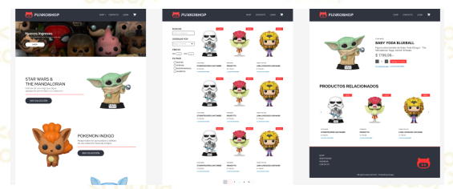

# Integrador-equipo-6
>### Proyecto Integrador del curso de NodeJs de Codo a Codo 4.0, comisión #23567, Profesor: Pablo Rovira.

[Ir al Figma](https://www.figma.com/file/IjTSeE2BpRd5Gk9VakNIhC/Challenge-Integrador---Funkoshop?type=design&node-id=0%3A1&mode=design&t=gmtnCAgPmvu10Fct-1)

>El sitio consta de 2 partes fundamentales, en primer lugar la tienda en
línea donde los clientes podrán ver todos los productos disponibles,
conocer su precio, stock y características. Además podrán registrarse
para agregar sus productos favoritos al carrito y ver el subtotal que
deben pagar.

>En segundo lugar, se necesita contar con las vistas necesarias para
administrar la tienda (admin o backoffice), ver el listado de productos
cargados y su stock, poder agregar, editar y eliminar items y sus
propiedades y que esos cambios se reflejen en tiempo real de cara al
cliente.

Teconologias que vamos a utilizar:
- FIGMA
- HTML
- CSS (Bootstrap es opcional)
- Javascript
- GIT y GITHUB
- Node JS + Express JS
- NPM
- Arquitectura MVC
- Template Engines
- MySQL y Gestores de BBDD
- Sequelize

 
 

|           Integrantes:           |
|----------------------------------|
|   Cinthia M. Orona               |
|   María Florencia Basualdo       |
|   Jesus Loreno Velasquez Giambona|
|   Ariadna Celeste Salomone       |
|   Carlos Barraza                 |
|   Melina Pereyra                 |
|   Carolina Pullo                 |
|   Yanina Jeanette Romero         |
